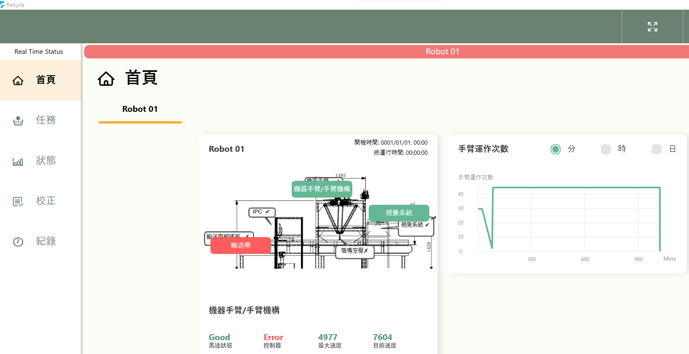
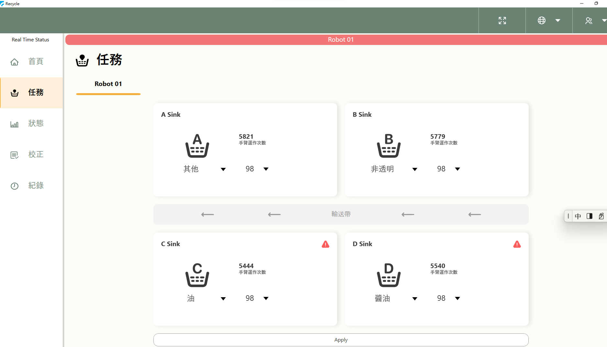
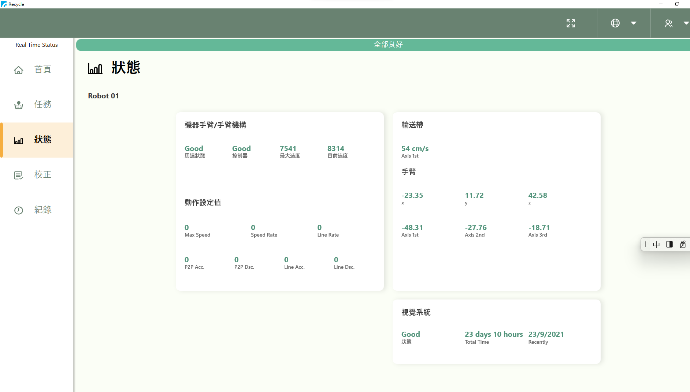
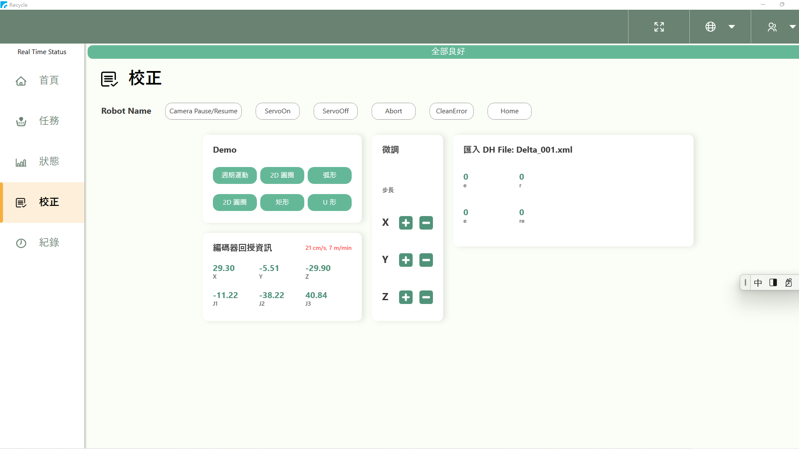
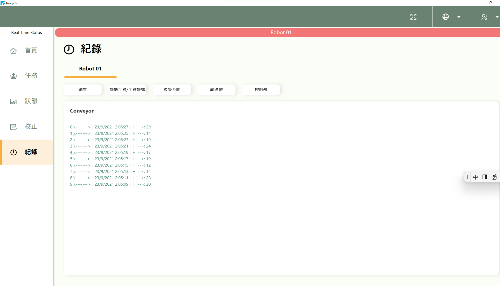

# WPF (工研院-協治 機器手臂) 使用文件首頁
請參考 github website [WPF](https://github.com/gilbert-sun/Recycle_1.7.git/) to Download WPF program.

*. 在執行WPF之前,須具備下列條件:

    [X]. Win10
    
    [X]. Visual Studio 2015 以上
    
    [X]. MongoDB package 安裝

*. 在執行WPF之前,須了解下列WPF和MongoDB的關係:

    [X]. WPF/MongoDB 目錄結構說明

[目錄結構說明](http://localhost:8080/articles/intro.html)

    [X]. 使用mongoDB API 對應首頁
[對應首頁](http://localhost:8080/articles/intro2.html)

    [X]. 使用mongoDB API 對應任務

[對應任務](http://localhost:8080/articles/intro3.html)

    [X]. 使用mongoDB API 對應紀錄

[對應紀錄](http://localhost:8080/articles/intro4.html)

*. 在您使用WPF應用程式之前,請先Win10安裝Server端MongoDB程式和Client端(Visual Studio 2019,VS2019)內的MongoDB安裝套件 

*. Win10的MongoDB需安裝Core/Drive(Server端/Client端)

*. Server端安裝步驟請參考mongoDB官網

--MongoDB 官網的步驟有點長,請耐心照著安裝完,官網site如下:

    *. https://docs.mongodb.com/manual/tutorial/install-mongodb-on-windows/

--若不指定IP則內定為127.0.0.1,Port為27017,若要指定請小心指定IP不要重複
    
    *. Server IP => http://localhost:port (localhost= http://127.0.0.1 , port= 27017)

*. Client端(VS2019)安裝mongoDB driver /core 1.31套件

## WPF 五個主要頁面:
--WPF對應手臂有五個主畫面,分別對應首頁,任務,狀態,校正,紀錄等,相關畫面如下

## WPF 第一頁面(首頁,Main Page):

## WPF 第二頁面(任務,Task Page):

## WPF 第三頁面(狀態,Status Page):

## WPF 第四頁面(校正,Cali Page):

## WPF 第五頁面(紀錄,Rec Page):

